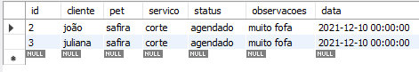

# Agenda de Atendimentos🐶

Este projeto trata-se de uma agenda de atendimentos de uma petshop imaginára, que através de uma API Rest, salva as anotações da agenda num Banco de Dados.

## Se você quiser analisar o código na sua máquina, execute o comando:😃

```
git clone https://github.com/jovimoura/agendaDeAtendimentos
```

## Como funciona? 🤔

Através do Node.JS eu instalei o Express e a Lib Mysql2, com o intuito de, através do Express, criar um servidor e ligá-lo a um banco de dados vazio com o Workbench do MySQL. Após isso, utilizando Node.JS, criei tabelas e métodos, que através das funções do Rest, eu consigo enviar dados a tabela, traze-los, edita-los e deleta-los, tudo isso contando com auxílio da plataforma <a href="https://www.postman.com/">Postman</a>, que foi essencial para manipulação dos GET's, PATCH's, UPDATE's e DELETE's presentes no código. E todas as funcionalidades de cada método estão bem explicados em comentários presentes por todo código😉.

## Foto da Tabela💻



## Tecnologias utilizadas🦉

<ul>
    <li>Node.JS</li>
    <li>Express</li>
    <li>MySQL</li>
    <li>Postman</li>
    <li>Cosign</li>
    <li>Moment</li>
    <li>Body-parser</li>
</ul>

## Autor🤗
## João Victor dos Santos Moura
## E-mail: joaovictors.mouraa@gmail.com
## LinkedIn: https://www.linkedin.com/in/jovimoura10/